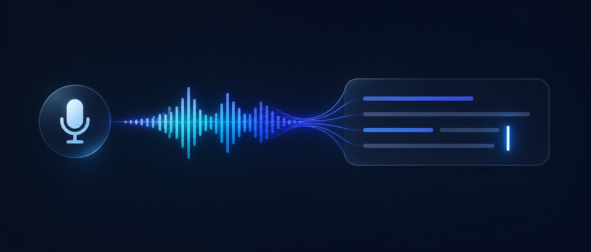
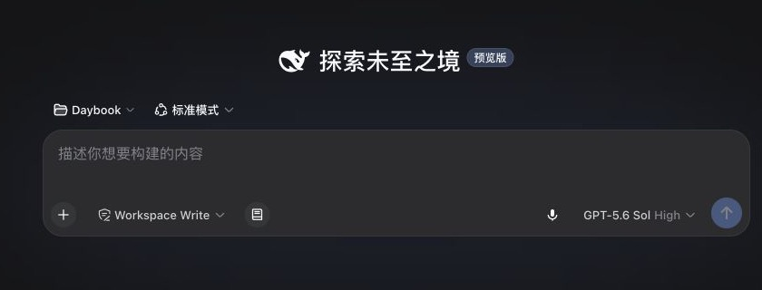
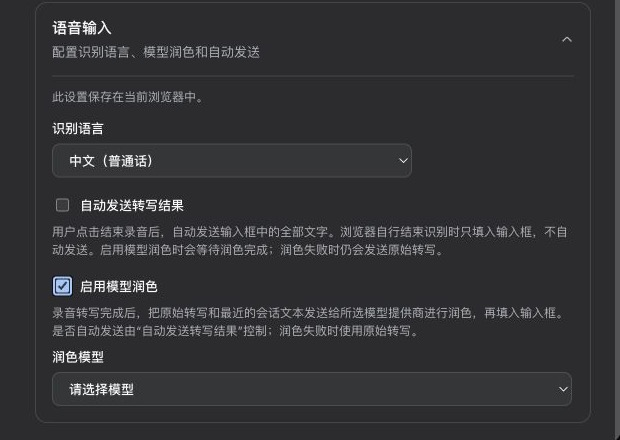

# dsh-dictate



**深度融入 DeepSeek Harness Composer 的上下文感知语音输入。默认即开即用，也可选择本地 SenseVoice 增强转写；停下可编辑，可用当前 Session 润色，发送权始终由用户控制。**

它不是实时语音对话插件：不会朗读模型回复，也不会启动双向语音会话。它把听写变成 Composer 的一种原生输入方式，让用户保留审阅、修改和发送文字的主动权。

## 快速安装

通过 npm `latest` 安装当前公开版本。当前兼容范围为 DSH `>=0.1.2-alpha.3 <0.2.0`；安装到 Web profile 后，重启对应的 `dsh web` 进程：

```sh
dsh plugin --profile web add dsh-dictate@latest
```

安装后前往“设置 → 插件 → 插件配置 → 上下文语音输入”。“浏览器语音识别”保持默认、无需安装；从 `0.4.0-alpha.8` 起，Apple Silicon Mac 和 Windows x64 均可选择实验性的本地识别。可用 `npm view dsh-dictate dist-tags --json` 核对当前渠道版本；Windows 安装和测试步骤见 [Windows x64 本地识别指南](https://github.com/franksong2702/dsh-dictate/blob/main/docs/windows-x64-local-asr.md)。

DSH Web 首次启动会打印一条带认证 token 的本机 URL。若直接访问端口看到 `DSHweb authentication required. Reopen the URL printed by DSHweb.`，请重新打开 DSH 启动输出中的完整 URL；不要复制或分享其中的 token。

## `v0.4.0-alpha.8` 新增

- 兼容基线与锁定依赖更新为官方 DSH `0.1.2-alpha.3`；上游 canary 同时监测 npm 的 `latest`、`next` 和 `alpha` 渠道。
- Windows x64 可以像 Apple Silicon 一样从插件设置页完成原生运行程序校验、SenseVoice Q8 模型下载、启动和状态检查。
- Windows 原生运行程序不签名，也不安装系统服务或托盘程序；启动时会打开名为 `DSH Dictate Local ASR` 的可见命令行窗口，关闭窗口即停止本地识别。
- 插件不要求管理员权限，也不修改系统 Python、PATH 或全局软件包。Windows 可能根据本机安全策略提示用户确认运行未签名程序。
- Windows x64 真机安装、DSH Web 认证和语音输入已完成人工验收；自动化 CI 继续覆盖打包、原生运行程序启动和 DSH Alpha.3 源码兼容。人工验收不替代签名、Windows ARM64 或后台服务支持。
- 这些改动来自已合并的 [PR #8](https://github.com/franksong2702/dsh-dictate/pull/8)，并已通过受保护的 release workflow 发布到 npm 与 [GitHub Releases](https://github.com/franksong2702/dsh-dictate/releases/tag/v0.4.0-alpha.8)。

## `v0.4.0-alpha.7` 新增

- 适配官方 DSH `0.1.2-alpha.2` 包与当前客户端扩展契约，最低兼容版本同步提升为 `0.1.2-alpha.2`。
- 修复 Alpha.2 `contenteditable` Composer 中右 Command 无法唤起语音输入的问题；快捷键仍只对当前聚焦的 Composer 生效。
- 锁定并验证官方 Alpha.2 npm 依赖图，同时保留独立源码兼容检查和隔离 profile 安装门禁。
- 保留 Web Speech 默认路线、可选本地 SenseVoice、单一 Composer 状态卡和用户控制发送权。

## `v0.4.0-alpha.5` 新增

- Apple Silicon 原生 ASR 运行程序随插件发行包提供，不再要求公开用户配置内部安装源。
- 设置页可从空白状态完成运行程序校验、SenseVoice Q8 模型下载、断点续传、完整性校验、服务启动和首次模型加载。
- 原生运行程序源码、固定依赖和第三方许可证说明进入仓库；打包校验会拒绝缺失或摘要不匹配的运行程序。
- macOS Intel、Windows 和 Linux 在该版本中继续明确显示为暂不支持本地语音识别，仍可使用默认的 Web Speech。
- 设置页直接说明浏览器识别与本地识别的安装、网络和隐私差异；本地识别不可用时不再静默回退，只允许用户明确选择本次改用浏览器识别。

## `v0.4.0-alpha.4` 新增

- 可在 Web Speech 默认路线之外，选择仅连接回环地址的本地 SenseVoice 端点。
- 可直接从插件设置页启动、停止、检查本地服务，并可显式开启“随 DSH 自动启动”。
- 兼容 DSH `0.1.1-rc.2`，并修复服务并发启动、CORS origin 变化、安装取消和断点下载边界。
- 本地录音会确认“已检测到语音”，停止时保留约 600 ms 结尾音频，再显示清晰的转写、润色和完成状态。
- `alpha.4` 当时允许配置本地服务不可用时的回退策略；已经录制的音频不会静默发送到其他服务。`alpha.5` 起改为每次都由用户明确选择。
- Web Speech 仍是默认选项，现有用户无需安装本地模型或改变原有输入方式。

## 核心优势

- **Composer 原生融合**：麦克风直接位于 Composer 工具栏；Web Speech 的实时文字或本地端点的录音、转写状态都显示在 Composer 上方，而不是出现在独立悬浮组件中。
- **两种可选路线**：Web Speech 保持默认且零配置；本地服务端点是可选的实验性增强模式，使用 SenseVoice 做停止后的最终转写，不在浏览器中下载或运行 WASM 模型。
- **可确认的本地录音**：本地模式检测到持续语音后会在 Composer 辅助文案中确认，并在用户停止后继续保留约 600 ms 结尾音频，减少最后一句被截断的风险。
- **免鼠标录音快捷键**：可在设置中启用；光标位于 Composer 时，macOS 单击右 Command，Windows/Linux 单击右 Control，按一次开始、再按一次结束。
- **可选的按住说话**：可在设置中启用；在 Composer 内按住鼠标 500 ms 开始录音，松开后只把最终结果写入光标位置，不会自动发送。
- **上下文词汇提取**：所选模型会根据当前 Session 和 Composer 提取相关词汇，提高语音识别和转写润色的准确度；模型不可用时使用规则词汇。
- **上下文模型润色**：可以选择当前 DSH 可用模型，并参考当前 Session 最近 6 条可见用户/Assistant 文本润色转写。
- **安全的自动发送**：只有用户明确点击结束录音才获得自动发送授权；浏览器自行结束识别时只填入 Composer。
- **默认可检查、可编辑**：模型润色和自动发送均默认关闭。用户可以先检查转写，再决定是否发送。
- **清晰的隐私范围**：润色不读取系统提示词、工具调用、工具结果、图片或 Assistant 推理内容；上下文最多 12 KB。
- **无需配置 ASR Key**：默认使用 Chrome 或 Edge 的 Web Speech API；受支持平台上的本地模式由插件自动管理 SenseVoice，用户无需了解服务地址或端口。

## 界面

麦克风直接出现在 DSH Composer 工具栏中。默认 Web Speech 模式会在录音时显示实时转写；本地端点模式会显示录音和最终转写状态。两种模式停止后都只把最终文字写入输入框一次。

### 模型润色

启用后，插件会在停止录音后把初步转写与最近的可见 Session 文本交给所选模型整理用词和标点，再将最终结果写入 Composer。自动发送保持关闭时，用户仍可检查和编辑结果。

### 其他使用方式

- **默认流程**：模型润色和自动发送均保持关闭；停止录音后，原始转写会留在 Composer 中供用户检查和编辑。
- **自动发送**：模型润色保持关闭；用户主动停止录音后，原始转写会直接提交给 DSH。浏览器自行结束识别时不会自动发送。
- **模型润色并自动发送**：插件会等待模型润色完成，再把润色后的文字提交给 DSH；润色失败时使用原始转写。



语言、中英混合识别优化、Composer 录音快捷键、模型润色和自动发送统一放在“设置 → 插件 → 插件配置 → 上下文语音输入”中，不增加独立设置 Tab。

<p align="center">
  
</p>

## 使用流程

1. 单击 Composer 工具栏中的麦克风开始录音；如果启用了快捷键，也可以在 Composer 文本框聚焦时单击右 Command（macOS）或右 Control（Windows/Linux）。还可单独启用“Composer 按住说话”，在输入框内按住鼠标 500 ms 开始、松开结束。
2. Web Speech 模式下，说话过程中可查看最终文字和仍可能修正的临时文字；本地端点模式检测到持续语音后会显示“已检测到语音”，停止后再由 SenseVoice 返回最终文字。中间状态不会写入正式草稿。
3. 再次单击麦克风或同一个右侧修饰键结束录音；插件只把最终文字写入 Composer 一次。
4. 如果启用了模型润色，插件会等待所选模型完成润色，再把结果填入 Composer。润色失败时保留原始转写。
5. 如果启用了自动发送，只有这次由用户主动结束的录音会自动提交；否则文字留在 Composer 中供用户编辑。

转写完成提示会在 3 秒后自动消失。内容写入 Composer 或发送后，状态区域不会重复保留正文预览。

## 配置与数据范围

- “语音识别”默认为“浏览器语音识别”。两个选项会直接说明是否需要安装、是否依赖网络以及音频的处理位置。从 `0.4.0-alpha.8` 起，Apple Silicon Mac 与 Windows x64 均提供“本地语音识别（实验性）”。插件自动安装、启动并检查本地识别环境，设置页不要求用户配置服务地址或端口。
- 本地识别在录音开始前不可用时，插件会提示用户重试，或明确选择“本次改用浏览器识别”；不会根据历史设置自动切换。已经录制的音频如果转写失败，也不会发送到其他服务。
- 在“设置 → 插件 → 插件配置”的“上下文语音输入”卡片中选择识别语言；设置保存在当前浏览器中。
- 选择普通话、粤语或繁体中文时，可以启用“优化中英混合识别”。插件会从当前 Session 最近的可见用户/Assistant 文本和 Composer 草稿中提取受限的临时词汇；系统提示词、工具调用、工具结果、图片和 Assistant 推理内容不会参与提取。
- Web Speech 模式下，浏览器支持 contextual phrases 时，插件会优先保留完整专有短语、剔除重叠碎片，并按 Composer、最近上下文和重复次数分配 2–6 的临时权重；不支持或拒绝短语增强时自动使用普通识别，不中断录音。本地 SenseVoice 端点当前不接收这批动态词汇，但模型润色仍会使用它们。
- 启用模型润色时，所选模型会在录音前后台提取当前 Session 和 Composer 中可追溯的相关词汇，并与规则词汇合并；同一批临时词汇会作为提示连同原始转写和最近的会话文本发送给所选模型提供商。词汇只用于本次录音，不会持久化；录音启动不等待后台提取。
- “启用 Composer 录音快捷键”默认关闭。快捷键只在当前 Composer 文本框聚焦时生效，与其他按键组合、长按重复或输入法组合状态均不会触发。
- “启用 Composer 按住说话”默认关闭。开启后，空 Composer 显示“按住鼠标 语音输入文字”；无选区时把最终结果插入光标位置，部分选中文字时不触发，全部选中时替换全文。鼠标松开只结束录音并写入最终结果，即使开启自动发送也不会提交消息；识别或润色失败时原文保持不变。
- “启用模型润色”默认关闭。开启后，从当前 DSH 可用模型列表中选择一个模型。
- 模型润色会发送原始转写和当前 Session 最近 6 条可见用户/Assistant 文本给所选模型的提供商。
- “自动发送转写结果（Beta）”默认关闭。用户主动结束录音后，自动发送全部文字。识别或润色结果可能有误，建议保持关闭，并在 Composer 中检查后手动发送。
- Web Speech API 的音频由浏览器语音服务处理，不经过 DSH 服务端。
- 本地端点模式在浏览器内录制单声道音频，转换为 16 kHz PCM WAV 后发送到回环地址的 OpenAI 兼容接口 `/v1/audio/transcriptions`；不会下载浏览器内 WASM 模型。

### 启动本地 SenseVoice 端点

在受支持版本的 Apple Silicon Mac 和 Windows x64 上，可以从插件设置页完成本地 ASR 的安装、启动、停止和状态检查。约 4.4 MB 的 macOS 运行程序和约 4.8 MB 的 Windows 运行程序随各自支持版本的插件包提供；首次安装只需下载约 253 MB 的 SenseVoice Q8 模型。运行程序和模型都会经过 SHA-256 校验并安装到当前 `DSH_HOME`，不会修改系统 Python、PATH 或全局软件包。实际下载和首次加载时间取决于网络、磁盘和 CPU。设置页会如实区分准备运行程序、下载模型、完整性校验、加载模型、检查服务和已就绪等阶段，并提供取消、重试和诊断摘要。

取消安装会终止插件管理的服务进程；再次安装时会重新校验本地缓存，并在可验证的情况下复用完整下载残片。安装完成后可以显式开启“随 DSH 自动启动”，后续启动会直接加载已经校验的本地模型。

Windows x64 启动本地识别时会打开一个可见的 `DSH Dictate Local ASR` 命令行窗口；窗口用于明确告知本地服务正在运行，关闭窗口即停止服务。该 `.exe` 不签名，不需要管理员权限。macOS Intel、Windows ARM64 和 Linux 当前没有随包提供原生运行程序，继续使用默认的 Web Speech。服务连接细节由插件内部管理，不在用户设置中暴露。

“随 DSH 自动启动”默认关闭。开启后，选项与当前 DSH origin 会保存到当前 profile；此后 DSH host 启动时会自动启动插件管理的本地服务并加载已缓存的模型。关闭选项只影响后续启动，不会立即停止当前正在运行的服务。

SenseVoiceSmall 模型及原生推理依赖的来源、作者和许可证信息见 [THIRD_PARTY_NOTICES.md](THIRD_PARTY_NOTICES.md)。

## 兼容性与 Alpha 限制

- `0.4.0-alpha.8` 的最低兼容版本为 DSH `0.1.2-alpha.3`；上游 canary 继续独立监测 npm 的 `latest`、`next` 和 `alpha` 渠道。
- Web Speech 默认模式需要 Chrome 或 Edge 的 Web Speech API。本地端点模式需要浏览器的麦克风与 Web Audio 能力；两种模式首次使用时都需要授予麦克风权限。
- 本地语音识别是停止录音后的最终转写，目前提供 VAD 语音确认和约 600 ms 尾音保护，但不提供实时临时文字；本地服务由插件手动或随 DSH 自动管理。
- 中英混合识别优化依赖浏览器及当前语音识别服务对 Web Speech contextual phrases 的支持；不支持时仍保留现有识别与模型润色流程。
- 从 `0.4.0-alpha.8` 起，本地 ASR 一键安装支持 macOS Apple Silicon 和 Windows x64。macOS 随包运行程序采用 ad-hoc 签名，尚未使用 Apple Developer ID 公证；Windows `.exe` 明确保持未签名并显示命令行窗口。macOS Intel、Windows ARM64 和 Linux 继续使用 Web Speech。
- 当前 DSH 尚未为外部插件开放自定义辅助模型请求的 Session 日志事件。插件辅助模型调用（词汇提取与润色）使用自己的受信 RPC，不会写入 DSH Session 日志；上游提供相应扩展点后应迁移到可重建的日志事件。

## 开发

```sh
pnpm install
pnpm test
pnpm run typecheck
pnpm run test:package
pnpm pack
```
