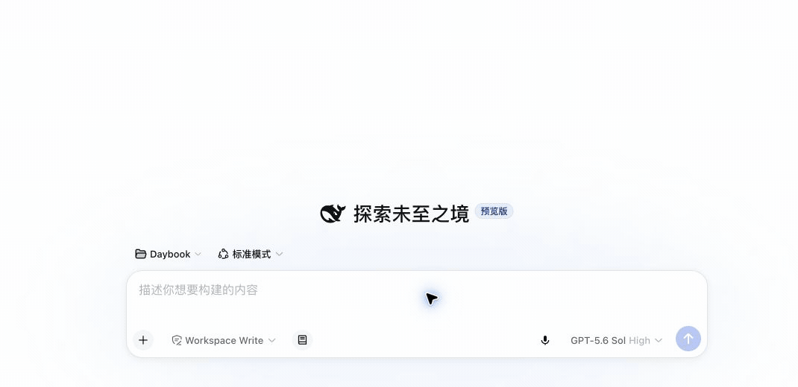

# dsh-dictate


**深度融入 DeepSeek Harness Composer 的上下文感知语音输入。默认即开即用，也可选择本地 SenseVoice 增强转写；停下可编辑，可用当前 Session 润色，发送权始终由用户控制。**

它不是实时语音对话插件：不会朗读模型回复，也不会启动双向语音会话。它把听写变成 Composer 的一种原生输入方式，让用户保留审阅、修改和发送文字的主动权。

## 核心优势

- **Composer 原生融合**：麦克风直接位于 Composer 工具栏；Web Speech 的实时文字或本地端点的录音、转写状态都显示在 Composer 上方，而不是出现在独立悬浮组件中。
- **两种可选路线**：Web Speech 保持默认且零配置；本地服务端点是可选的实验性增强模式，使用 SenseVoice 做停止后的最终转写，不在浏览器中下载或运行 WASM 模型。
- **免鼠标录音快捷键**：可在设置中启用；光标位于 Composer 时，macOS 单击右 Command，Windows/Linux 单击右 Control，按一次开始、再按一次结束。
- **上下文词汇提取**：所选模型会根据当前 Session 和 Composer 提取相关词汇，提高语音识别和转写润色的准确度；模型不可用时使用规则词汇。
- **上下文模型润色**：可以选择当前 DSH 可用模型，并参考当前 Session 最近 6 条可见用户/Assistant 文本润色转写。
- **安全的自动发送**：只有用户明确点击结束录音才获得自动发送授权；浏览器自行结束识别时只填入 Composer。
- **默认可检查、可编辑**：模型润色和自动发送均默认关闭。用户可以先检查转写，再决定是否发送。
- **清晰的隐私范围**：润色不读取系统提示词、工具调用、工具结果、图片或 Assistant 推理内容；上下文最多 12 KB。
- **无需配置 ASR Key**：默认使用 Chrome 或 Edge 的 Web Speech API；本地模式只把录音发送到用户配置的回环地址，音频均不经过 DSH 服务端。

## 界面

麦克风直接出现在 DSH Composer 工具栏中。默认 Web Speech 模式会在录音时显示实时转写；本地端点模式会显示录音和最终转写状态。两种模式停止后都只把最终文字写入输入框一次。

### 模型润色



这段真实演示体现了插件最有代表性的流程：边说边显示实时转写，停止后由所选模型结合最近的 Session 文本整理用词和标点，再把结果写入 Composer。演示关闭了自动发送，因此用户仍可检查和编辑。

### 其他使用方式

- **默认流程**：模型润色和自动发送均保持关闭；停止录音后，原始转写会留在 Composer 中供用户检查和编辑。
- **自动发送**：模型润色保持关闭；用户主动停止录音后，原始转写会直接提交给 DSH。浏览器自行结束识别时不会自动发送。
- **模型润色并自动发送**：插件会等待模型润色完成，再把润色后的文字提交给 DSH；润色失败时使用原始转写。


语言、中英混合识别优化、Composer 录音快捷键、模型润色和自动发送统一放在“设置 → 插件 → 插件配置 → 上下文语音输入”中，不增加独立设置 Tab。

<p align="center">
  
</p>

## 使用流程

1. 单击 Composer 工具栏中的麦克风开始录音；如果启用了快捷键，也可以在 Composer 文本框聚焦时单击右 Command（macOS）或右 Control（Windows/Linux）。
2. Web Speech 模式下，说话过程中可查看最终文字和仍可能修正的临时文字；本地端点模式下，保持录音直到说完，停止后再由 SenseVoice 返回最终文字。中间状态不会写入正式草稿。
3. 再次单击麦克风或同一个右侧修饰键结束录音；插件只把最终文字写入 Composer 一次。
4. 如果启用了模型润色，插件会等待所选模型完成润色，再把结果填入 Composer。润色失败时保留原始转写。
5. 如果启用了自动发送，只有这次由用户主动结束的录音会自动提交；否则文字留在 Composer 中供用户编辑。

转写完成提示会在 3 秒后自动消失。内容写入 Composer 或发送后，状态区域不会重复保留正文预览。

## 配置与数据范围

- “转写方式”默认为“浏览器语音识别”。选择“本地服务端点（实验性）”后，可配置一个 `localhost`、`127.0.0.1` 或 `[::1]` 回环地址；插件拒绝把麦克风录音发送到其他主机。
- 在“设置 → 插件 → 插件配置”的“上下文语音输入”卡片中选择识别语言；设置保存在当前浏览器中。
- 选择普通话、粤语或繁体中文时，可以启用“优化中英混合识别”。插件会从当前 Session 最近的可见用户/Assistant 文本和 Composer 草稿中提取受限的临时词汇；系统提示词、工具调用、工具结果、图片和 Assistant 推理内容不会参与提取。
- Web Speech 模式下，浏览器支持 contextual phrases 时，插件会优先保留完整专有短语、剔除重叠碎片，并按 Composer、最近上下文和重复次数分配 2–6 的临时权重；不支持或拒绝短语增强时自动使用普通识别，不中断录音。本地 SenseVoice 端点当前不接收这批动态词汇，但模型润色仍会使用它们。
- 启用模型润色时，所选模型会在录音前后台提取当前 Session 和 Composer 中可追溯的相关词汇，并与规则词汇合并；同一批临时词汇会作为提示连同原始转写和最近的会话文本发送给所选模型提供商。词汇只用于本次录音，不会持久化；录音启动不等待后台提取。
- “启用 Composer 录音快捷键”默认关闭。快捷键只在当前 Composer 文本框聚焦时生效，与其他按键组合、长按重复或输入法组合状态均不会触发。
- “启用模型润色”默认关闭。开启后，从当前 DSH 可用模型列表中选择一个模型。
- 模型润色会发送原始转写和当前 Session 最近 6 条可见用户/Assistant 文本给所选模型的提供商。
- “自动发送转写结果（Beta）”默认关闭。用户主动结束录音后，自动发送全部文字。识别或润色结果可能有误，建议保持关闭，并在 Composer 中检查后手动发送。
- Web Speech API 的音频由浏览器语音服务处理，不经过 DSH 服务端。
- 本地端点模式在浏览器内录制单声道音频，转换为 16 kHz PCM WAV 后发送到回环地址的 OpenAI 兼容接口 `/v1/audio/transcriptions`；不会下载浏览器内 WASM 模型。

### 启动本地 SenseVoice 端点

安装支持 `funasr-server` 的 FunASR 环境后，可以从插件设置页启动、停止并检查服务状态。DSH host 必须能在 `PATH` 中找到 `funasr-server`，也可以用服务端环境变量明确指定路径和工作目录：

```sh
export DSH_DICTATE_FUNASR_SERVER=/absolute/path/to/funasr-server
export DSH_DICTATE_FUNASR_WORKDIR=/absolute/path/to/model-workspace
```

插件启动的进程固定绑定 `127.0.0.1:39081`，固定使用 CPU 和 SenseVoice，并只允许当前回环 DSH origin 跨域访问。浏览器不能向 RPC 传递命令、可执行路径或额外进程参数。

也可以在插件外部手动启动服务。`--cors-origin` 必须与浏览器地址栏中的 DSH origin 完全一致；下面以测试环境 `http://127.0.0.1:3081` 为例：

```sh
funasr-server \
  --host 127.0.0.1 \
  --port 39081 \
  --device cpu \
  --model sensevoice \
  --cors-origin http://127.0.0.1:3081
```

然后在“设置 → 插件 → 插件配置 → 上下文语音输入”中选择“本地服务端点（实验性）”，服务地址保留默认的 `http://127.0.0.1:39081`。设置页会区分插件管理的进程与外部服务；外部服务可以检查但不能由插件停止。服务未启动、CORS origin 不匹配或返回异常时，界面会显示可读错误；Web Speech 默认选项不受影响。

## 兼容性与 Alpha 限制

- 当前面向 DSH `0.1.0-rc.7`。
- Web Speech 默认模式需要 Chrome 或 Edge 的 Web Speech API。本地端点模式需要浏览器的麦克风与 Web Audio 能力；两种模式首次使用时都需要授予麦克风权限。
- 本地端点是停止录音后的最终转写，目前不提供实时临时文字；服务进程、SenseVoice 模型和 CORS 白名单由用户在本机单独管理。
- 中英混合识别优化依赖浏览器及当前语音识别服务对 Web Speech contextual phrases 的支持；不支持时仍保留现有识别与模型润色流程。
- 当前 DSH 尚未为外部插件开放自定义辅助模型请求的 Session 日志事件。插件辅助模型调用（词汇提取与润色）使用自己的受信 RPC，不会写入 DSH Session 日志；上游提供相应扩展点后应迁移到可重建的日志事件。

## 安装

下载 GitHub Release 中的 `dsh-dictate-0.4.0-alpha.3.tgz`，安装到 Web profile，然后重启对应的 `dsh web` 进程：

```sh
dsh plugin --profile web add ./dsh-dictate-0.4.0-alpha.3.tgz
```

## 开发

```sh
pnpm install
pnpm test
pnpm run typecheck
pnpm run test:package
pnpm pack
```
